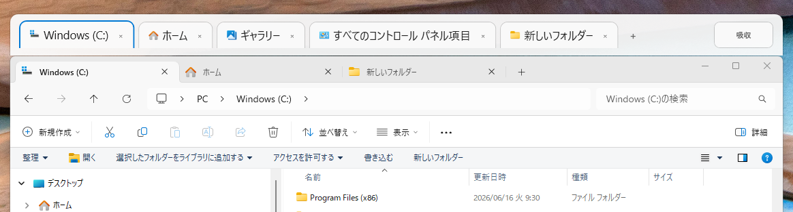

# KjTabBar

[Japanese README](./README_jp.md)

KjTabBar is a resident desktop application that integrates Windows Explorer (`explorer.exe`) with a custom tab bar so you can use it like a tabbed file manager.
Instead of hooking into or modifying Explorer itself, it places an independent tool window tightly above Explorer, providing stable behavior and high compatibility.

## Features

- **Tabbed window integration**
  - Multiple Explorer windows are managed across the system and consolidated into a single tab bar window.
- **Drag and drop support**
  - Reorder tabs with left-button drag
  - Move or copy files and folders onto tabs by dropping items from outside
  - Show a context menu on right-drag drop such as "Copy here" and "Move here"
- **Seamless tracking and UI integration**
  - Tracks Explorer position, size, and DPI scale changes in real time
  - Automatically follows the Windows dark/light mode setting
- **Stable resident behavior**
  - Stays in the system tray and manages resources appropriately in the background
  - Because the application is highly independent from Explorer itself, it is designed to be less affected by Windows updates and similar changes

## Requirements

- OS: Windows 10 / Windows 11
- Runtime: .NET environment (prepare it according to the specification)

## Usage

1. Launch the application (`KjTabBar.exe`). It will stay resident in the system tray.
2. Open Windows Explorer. A tab bar will automatically appear at the top of the window.
3. When you open a new Explorer window from the desktop or certain shortcuts, it is automatically absorbed and integrated into the existing tab bar as a new tab.
4. **Tab operations**
   - Use the `+` button on the right to open a new tab (folder).
   - Right-click a tab to access actions such as `Duplicate Tab`, `Open in New Window`, `Copy Path`, and `Close Tab`.
5. **Settings**
   - Right-click the background area of the tab bar and choose `Settings...` to change options such as the tab font size.
6. To exit, right-click the task tray icon and choose `Exit`.

## Installation and Uninstallation

- During installation, the setup custom action registers the application for startup (`HKCU\Software\Microsoft\Windows\CurrentVersion\Run`).
- During uninstallation, the dedicated uninstaller cleans up the registry entry for auto-start. The settings file (`settings.xml`) and tab history file (`tabs.txt`) are kept under `%APPDATA%\KjTabBar` as user data.

## License

This project is distributed under the **MIT License**.
For details, see the [LICENSE](LICENSE) file.

## Download

Latest version:

https://github.com/keasj/KjTabBar/releases/latest

